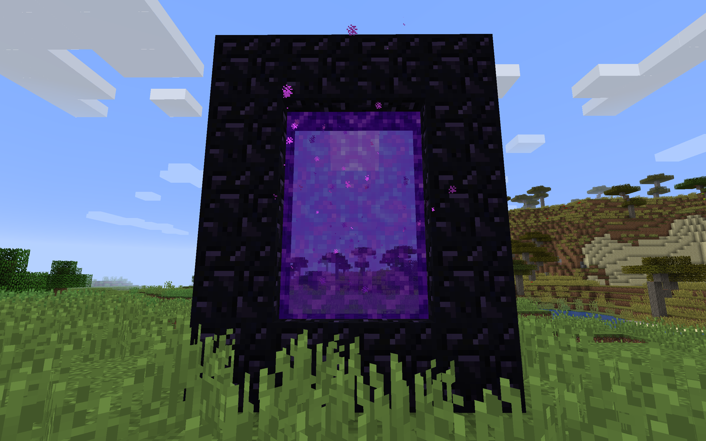

# Enroocraft

Portals in _Minecraft_ look like this:

Cool, but could be much cooler. What if it were possible to see what's on the other side, and move through them instantly, as in _Portal_ (2007)?

_Enroocraft_ is a simple _Minecraft_ clone written to explore 3D rendering techniques for creating this effect. The result looks like this:

(note: the gif framerate is lower than that of the game)

